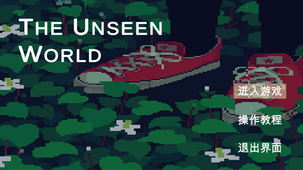
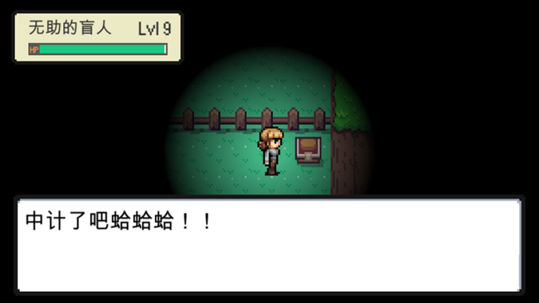

## 目录

- [背景](#背景)
- [游戏简单演示](#游戏简单演示)
- [主要项目负责人](#主要项目负责人)
- [贡献人员](#贡献人员)
- [开源协议](#开源协议)

## 背景

类pokemon回合制RPG

## 游戏简单演示

开始菜单：显示游戏标题、背景以及进入游戏、教程按钮和退出游戏按钮，按钮默认选中进入游戏按钮，可以通过鼠标也可以通过键盘进行选择。

 

引导场景：玩家与NPC进行对话，获取游戏操作提示。
 

主场景：玩家视野受限，可自由探索地图，与地图交互，进行对战或与NPC对话。HUD显示玩家当前等级与血量。其中，玩家的视野范围和等级挂钩，等级越高，视野范围越广，象征着玩家在体验盲人生活的过程中经历重重苦难，逐渐获得光明（存疑）。
 

场景内有很多可以互动的人和物品，他们的头顶都标有感叹号，玩家可以按Z键与NPC互动，也可以和告示牌互动查看一些重要的讯息，感叹号也会在互动后消失。

玩家走到伤害区域掉血，可通过拾取道具回血。

玩家会在不同的情景遇到不同的敌人，在草地遇到螳螂，遇到惹事的坏人npc，甚至会遇到欺骗玩家去打开的宝箱怪，触发回合制战斗。

玩家触发对战：可选择不同策略应对，包括不同攻击效果，切换角色与逃跑。其中，玩家的血量是与地图血量同步的，任意一个场景的主角在血量为0时直接游戏失败。

可以切换战斗角色，不同角色有不同的专长，通过不同角色的攻击配合可以增加战斗效率。

招式主要分为控制类技能、直伤技能和特攻技能，有些招式是上述三种类型的组合效果，有的既能打出控制延缓敌人行动又能回合内出伤，也有的既能为敌人挂上负面效果又能打出伤害。在使用招式时，会触发角色行动动画。

在任意一方的回合内，若存在负面效果，会通过画面下面的方框打印状态信息，若该负面效果会对该对象造成伤害，也会同步更新血条变化的动画。

双方入场时会播放入场动画，当任意一方倒下时也会播放对应的退场动画。

战斗结束后，当前场上的角色会获得经验值，经验值达到下一等级所需的经验就会升级并触发升级音效，同时经验条会回退到0重新开始。若当前场上获胜的不是主角而是她的队友，主角还会在队友获得完经验值后也换到场上来获得等量的经验值。另外，升级以后血量会回复到满血。

玩家达到一定等级后，视野范围变到最大，游戏通关，显示通关界面，游戏结束。

to be continued...

## 主要项目负责人

[@duluge](https://github.com/duluge)

### 贡献人员

[@duluge](https://github.com/duluge)

## 开源协议

[MIT](LICENSE) ©

